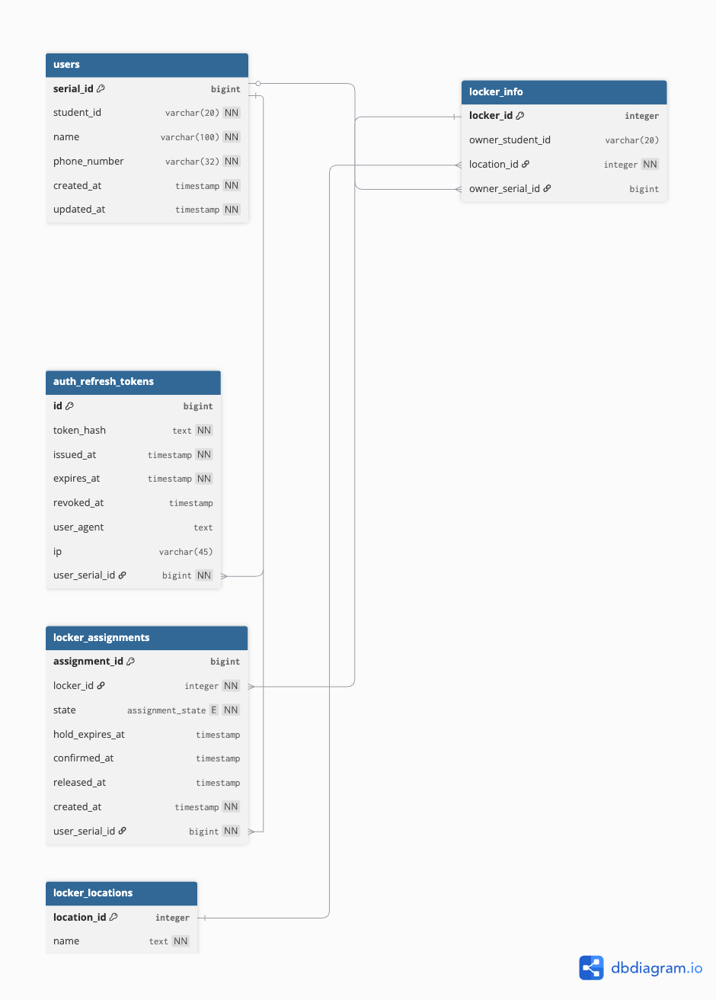

# Locker Reservation System

<div align="center">

**고려대학교 정보대학 제9대 학생회 사물함 선착순 예약 시스템**

[](https://go.dev/)
[](https://gofiber.io/)
[](https://www.postgresql.org/)
[](https://redis.io/)
[](https://www.docker.com/)

</div>

---

## 목차

- [개요](#-개요)
- [주요 기능](#-주요 기능)
- [기술 스택](#-기술-스택)
- [시스템 아키텍처](#-시스템-아키텍처)
- [빠른 시작](#-빠른-시작)
- [개발 환경 설정](#-개발-환경-설정)
- [API 문서](#-api-문서)
- [데이터베이스 스키마](#-데이터베이스-스키마)
- [프로젝트 구조](#-프로젝트-구조)
- [테스트](#-테스트)
- [문제 해결](#-문제-해결)

---

## 개요

고려대학교 정보대학 학생들을 위한 사물함 선착순 예약 시스템의 백엔드 서버입니다. 실시간 경쟁 상황에서 안정적인 사물함 예약을 지원하며, Redis를 활용한 원자적 연산으로 동시성 문제를 해결합니다.

### 핵심 특징

- **고성능**: Fiber 프레임워크 기반의 빠른 응답 속도
- **동시성 제어**: Redis를 활용한 원자적 사물함 선점 처리
- **보안**: JWT 기반 인증 및 Refresh Token 관리
- **실시간 모니터링**: 헬스체크 및 자동 정리 스케줄러
- **컨테이너화**: Docker Compose를 통한 간편한 배포
- **API 문서**: Swagger를 통한 자동 문서화

---

## 주요 기능

### 인증 시스템
- 학번/이름/전화번호 기반 로그인 또는 자동 회원가입
- JWT Access Token (30분) 및 Refresh Token (14일) 발급
- 토큰 블랙리스트 관리 및 로그아웃

### 사물함 관리
- **목록 조회**: 전체 사물함 정보 및 점유 상태 확인
- **선점(Hold)**: Redis 원자 연산을 통한 15분 임시 선점
- **확정(Confirm)**: 선점한 사물함 최종 확정
- **해제(Release)**: 사물함 반납 및 상태 초기화
- **내 사물함 조회**: 현재 소유한 사물함 정보

### 자동화 시스템
- **실시간 정리**: Redis Keyspace Notification을 통한 만료 처리
- **백그라운드 스케줄러**: 10초마다 만료된 선점 자동 정리
- **헬스체크**: PostgreSQL 및 Redis 연결 상태 모니터링

---

## 기술 스택

### Backend
- **Language**: Go 1.23
- **Framework**: Fiber v2.52
- **Database**: PostgreSQL 16
- **Cache**: Redis 7
- **ORM**: pgx/v5 (PostgreSQL driver)

### Infrastructure
- **Containerization**: Docker & Docker Compose
- **Reverse Proxy**: Nginx (프로덕션)
- **Cloud**: AWS EC2 (선택적)

### Development Tools
- **API Documentation**: Swagger/OpenAPI
- **Authentication**: JWT (golang-jwt/v5)
- **Configuration**: godotenv

---

## 시스템 아키텍처

```
┌─────────────────┐
│   Client App    │
│   (Frontend)    │
└────────┬────────┘
         │ HTTPS/HTTP
         ▼
┌─────────────────┐
│  Fiber Server   │◄──────┐
│   (Port 3000)   │       │
└────────┬────────┘       │
         │                │
    ┌────┴────┐      ┌────┴────┐
    ▼         ▼      ▼         ▼
┌────────┐  ┌────────────┐  ┌──────────┐
│ Redis  │  │ PostgreSQL │  │ Swagger  │
│ (6379) │  │   (5432)   │  │   UI     │
└────────┘  └────────────┘  └──────────┘
   Cache       Database       API Docs
```

---

## 빠른 시작

### 필수 요구사항

- Go 1.23+
- Docker & Docker Compose
- Git

### 1. 저장소 클론

```bash
git clone https://github.com/KUCSEPotato/Go_server.git
cd Go_server/locker-server
```

### 2. Docker로 실행

```bash
# 모든 서비스 시작 (PostgreSQL + Redis + App)
docker compose up -d

# 로그 확인
docker compose logs -f

# 헬스체크
curl http://localhost:3000/api/v1/health
```

### 3. API 문서 확인

브라우저에서 접속: http://localhost:3000/swagger/index.html

---

## 개발 환경 설정

### 로컬 개발 모드

```bash
# 1. 환경 변수 설정
cp configs/.env.example configs/.env
vim configs/.env  # 필요한 값 수정

# 2. 의존성 설치
go mod download

# 3. PostgreSQL & Redis만 Docker로 실행
docker compose up -d postgres redis

# 4. 데이터베이스 마이그레이션
make migrate

# 5. 서버 실행
go run ./cmd/server/main.go
```

### Swagger 문서 갱신

```bash
# swag CLI 설치 (최초 1회)
go install github.com/swaggo/swag/cmd/swag@latest

# PATH 설정 (필요시)
export PATH=$PATH:$(go env GOPATH)/bin

# 문서 재생성
swag init -g cmd/server/main.go -o docs
```

## API 문서

### 주요 엔드포인트

#### 인증
- `POST /api/v1/auth/login-or-register` - 로그인 또는 자동 회원가입
- `POST /api/v1/auth/refresh` - Access Token 갱신
- `POST /api/v1/auth/logout` - 로그아웃 (토큰 무효화)
- `GET /api/v1/auth/me` - 현재 사용자 정보

#### 사물함
- `GET /api/v1/lockers` - 전체 사물함 목록 조회
- `GET /api/v1/lockers/me` - 내 사물함 조회
- `POST /api/v1/lockers/:id/hold` - 사물함 선점 (15분)
- `POST /api/v1/lockers/:id/confirm` - 사물함 확정
- `POST /api/v1/lockers/:id/release` - 사물함 해제
- `POST /api/v1/lockers/:id/release-hold` - Hold 상태 해제

#### 시스템
- `GET /api/v1/health` - 헬스체크 (DB, Redis)

### API 사용 예제

#### 1. 로그인 또는 회원가입

```bash
curl -X POST http://localhost:3000/api/v1/auth/login-or-register \
  -H "Content-Type: application/json" \
  -d '{
    "student_id": "20231234",
    "name": "홍길동",
    "phone_number": "01012345678"
  }'
```

#### 2. 사물함 선점

```bash
curl -X POST http://localhost:3000/api/v1/lockers/101/hold \
  -H "Authorization: Bearer YOUR_ACCESS_TOKEN"
```

#### 3. 사물함 확정

```bash
curl -X POST http://localhost:3000/api/v1/lockers/101/confirm \
  -H "Authorization: Bearer YOUR_ACCESS_TOKEN"
```

#### 4. 내 사물함 조회

```bash
curl -X GET http://localhost:3000/api/v1/lockers/me \
  -H "Authorization: Bearer YOUR_ACCESS_TOKEN"
```

#### 5. Token 갱신

```bash
curl -X POST http://localhost:3000/api/v1/auth/refresh \
  -H "Content-Type: application/json" \
  -H "Authorization: Bearer ACCESS_TOKEN" \
  -d '{"refresh_token": "REFRESH_TOKEN"}'
```

---

## 데이터베이스 스키마

### ERD



[DBDiagram에서 보기](https://dbdiagram.io/d/locker-sever-db-68b51f3a777b52b76c695e34)

### 주요 테이블

#### `users`
학생 정보 관리
- `serial_id` (PK, bigint): 내부 일련번호 (자동 증가)
- `student_id` (varchar(20), NOT NULL): 학번
- `name` (varchar(100), NOT NULL): 이름
- `phone_number` (varchar(32), NOT NULL): 전화번호
- `created_at`, `updated_at` (timestamp): 생성/수정 시각
- **Unique 제약**: `(student_id, name, phone_number)` 조합

#### `locker_locations`
사물함 위치 정보
- `location_id` (PK, integer): 위치 ID
- `name` (text, NOT NULL, Unique): 위치명 (예: "정보관 1층", "정보관 2층")

#### `locker_info`
사물함 정보
- `locker_id` (PK, integer): 사물함 번호
- `owner_student_id` (varchar(20), nullable): 현재 소유자 학번 (레거시)
- `owner_serial_id` (bigint, FK → users.serial_id, Unique): 현재 소유자 ID
- `location_id` (integer, FK → locker_locations): 위치
- **제약**: 한 사용자는 최대 1개의 사물함만 소유 가능

#### `locker_assignments`
사물함 예약/배정 히스토리
- `assignment_id` (PK, bigint): 배정 ID (자동 증가)
- `locker_id` (integer, FK → locker_info): 사물함 번호
- `user_serial_id` (bigint, FK → users.serial_id): 사용자 ID
- `state` (assignment_state ENUM): 'hold', 'confirmed', 'cancelled', 'expired'
- `hold_expires_at` (timestamp): 선점(hold) 만료 시각 (15분)
- `confirmed_at` (timestamp): 확정 시각
- `released_at` (timestamp): 해제 시각
- `created_at` (timestamp): 배정 생성 시각
- **Unique 인덱스**:
  - 사물함당 1개의 active 배정 (hold 또는 confirmed)
  - 사용자당 1개의 active 배정 (hold 또는 confirmed)

#### `auth_refresh_tokens`
Refresh Token 관리
- `id` (PK, bigint): 토큰 ID (자동 증가)
- `token_hash` (text, NOT NULL, Unique): 해시된 토큰 (SHA-256)
- `user_serial_id` (bigint, FK → users.serial_id): 토큰 소유자
- `issued_at` (timestamp): 발급 시각
- `expires_at` (timestamp): 만료 시각 (14일)
- `revoked_at` (timestamp, nullable): 무효화 시각 (로그아웃 시)
- `user_agent` (text): 클라이언트 정보
- `ip` (varchar(45)): 발급 IP 주소

### 마이그레이션

```bash
# 초기 스키마 적용
make migrate

# PostgreSQL 컨테이너 접속
docker exec -it locker-prod-pg psql -U locker -d locker

# 데이터 초기화
TRUNCATE locker_assignments RESTART IDENTITY;
UPDATE locker_info SET owner_serial_id = NULL;
```

---

## 프로젝트 구조

```
locker-server/
├── cmd/
│   └── server/
│       └── main.go                # 애플리케이션 진입점
├── internal/
│   ├── api/
│   │   ├── router.go              # 라우트 설정
│   │   ├── handlers/              # HTTP 핸들러
│   │   │   ├── admin_helper.go    # 관리자 헬퍼 함수
│   │   │   ├── auth.go            # 인증 관련
│   │   │   ├── common.go          # 공통 유틸리티
│   │   │   ├── health.go          # 헬스체크
│   │   │   └── locker.go          # 사물함 관련
│   │   └── middleware/            # 미들웨어
│   │       └── jwt.go             # JWT 인증
│   ├── db/
│   │   ├── postgres.go            # DB 연결 풀
│   │   └── migrate/               # SQL 마이그레이션 파일
│   ├── cache/
│   │   └── redis.go               # Redis 클라이언트
│   ├── scheduler/                 # 백그라운드 작업
│   │   ├── cleanup.go             # 만료 처리
│   │   └── realtime_cleanup.go    # 실시간 정리
│   └── util/
│       └── jwt.go                 # JWT 유틸리티
├── configs/
│   └── .env.prod                  # 프로덕션 환경 변수
├── docker/
│   ├── .dockerignore              # Docker 빌드 제외 파일
│   ├── Dockerfile                 # 멀티스테이지 빌드
│   ├── docker-compose.prod.yml    # 프로덕션 Compose
│   └── internal/                  # 내부 Docker 관련 파일
├── docs/                          # Swagger 자동 생성 문서
├── tests/                         # 부하 테스트 스크립트 (.gitignore)
├── go.mod                         # Go 모듈 정의
├── go.sum                         # 의존성 체크섬
├── Makefile                       # 빌드 및 관리 명령어
├── locker-sever-db.png            # ERD 이미지
├── locker_db_dump_new.sql         # DB 덤프 파일 (.gitignore)
└── db_cleanup_and_migration.sql   # 정리 및 마이그레이션 SQL (.gitignore)
```

---

## 테스트 (.gitignore)

### 부하 테스트

```bash
cd tests

# 의존성 설치
pip install -r requirements.txt

# 부하 테스트 실행
./run_load_test.sh

# 빠른 테스트
python quick_test.py

# 경쟁 상태 테스트
python race_test.py
```

자세한 내용: [tests/LOAD_TEST_README.md](locker-server/tests/LOAD_TEST_README.md)

---

## 문제 해결

### 포트 충돌 (Address already in use)

```bash
# 사용 중인 프로세스 확인
lsof -i :3000

# 프로세스 종료
kill -9 <PID>

# 또는 Docker 정리
docker compose down
```

### PostgreSQL 접속 문제

```bash
# 컨테이너 상태 확인
docker compose ps

# 로그 확인
docker compose logs postgres

# 헬스체크
docker exec locker-prod-pg pg_isready -U locker
```

### Redis 연결 오류

```bash
# Redis 상태 확인
docker exec locker-prod-redis redis-cli ping

# 연결 테스트
docker exec locker-prod-redis redis-cli
> PING
PONG
```

### Swagger 문서가 업데이트되지 않음

```bash
# swag 재설치
go install github.com/swaggo/swag/cmd/swag@latest

# PATH 확인
echo $PATH | grep $(go env GOPATH)/bin

# 문서 재생성
swag init -g cmd/server/main.go -o docs

# 서버 재시작
go run ./cmd/server/main.go
```

---

## 기여

이 프로젝트는 고려대학교 정보대학 제9대 학생회에서 관리합니다.

### 참여자

<div align="center">

<table>
<tr>
<td align="center">
<a href="https://github.com/KUCSEPotato">

<br />
<b>이정민</b>
</a>
<br />
<a href="https://github.com/KUCSEPotato">GitHub: @KUCSEPotato</a>
<br />
<sub>고려대학교 컴퓨터학과 23학번</sub>
</td>
<td align="center">
<a href="https://github.com/hansungkd">

<br />
<b>김한성</b>
</a>
<br />
<a href="https://github.com/hansungkd">GitHub: @hansungkd</a>
<br />
<sub>고려대학교 컴퓨터학과 24학번</sub>
</td>
</tr>
</table>

</div>


## 라이센스

This project is private and proprietary.